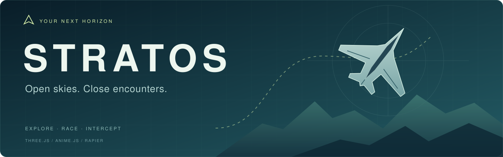

<div align="center">

**An open-world fighter jet game, built for the browser.**

Explore an archipelago, skim the coastline, and take on hostile aircraft in your SF–35 stealth fighter.

**Three.js · anime.js · Rapier · TypeScript · Vite**

[Get started](#get-started) · [How to play](#how-to-play) · [Controls](#controls) · [Development](#development) · [Credits](#asset-credits)

</div>

## Your next horizon

Stratos is a single-player flight and combat game set in Haven: a streamed world of islands, mountain ridges, beaches, and open water. Discover landmarks, thread checkpoint gates, or launch a combat sortie straight from the flight deck.

Easy flight controls and target-follow assistance let you focus on the action. Switch to Advanced mode when you want full loops and rolls.

| Fly your way        | What awaits                                                               |
| ------------------- | ------------------------------------------------------------------------- |
| **Free flight**     | Explore Haven, find five landmarks, and start a patrol whenever you like. |
| **Skyline circuit** | Six checkpoint gates and a race against the clock.                        |
| **Coastal run**     | Follow the coastline while staying below the altitude limit.              |
| **Intercept**       | Clear three hostile fighters from the airspace.                           |
| **Escort**          | Protect a transport as it flies to safety.                                |
| **Ground strike**   | Destroy an enemy radar site guarded by fighters.                          |

## Get started

Use **Node.js 22.12+** and npm, with a desktop browser that supports **WebGL 2**.

```sh
git clone https://github.com/TejasGov/Stratos.git
cd Stratos
npm ci
npm run dev
```

Open the local URL printed by Vite, wait for the aircraft and terrain materials to load, and choose a flight from the deck. Assets are included in the repository; no asset-service account or API key is required to play.

To serve a production build locally:

```sh
npm run build
npm run preview
```

## How to play

For your first dogfight, choose **Intercept**. Target follow starts enabled: the jet steers toward the selected fighter and adjusts thrust to help you stay with it.

1. Hold **left mouse / F** to fire the cannon.
2. Tap **right mouse / X** for a missile. A tap queues briefly while the lock finishes.
3. Use **T** to select another target and **V** when an incoming missile threatens you.
4. Press **G**, or use the HUD button, to toggle target follow. **WASD** takes manual control.

The **AIM** marker shows the cannon's predicted intercept point. Missile lock feedback explains when a target is out of alignment, too far away, obstructed, or waiting for cooldown. Cannon assistance is limited by angle and range; projectiles still have to hit.

### Flight that fits you

**Easy mode is the default.** A/D turns directly, W/S climbs or descends, and releasing the controls levels the aircraft. Move the mouse over the sky to steer when target follow is off.

**Advanced mode**, available in Settings, restores bank-based turns and unrestricted aerobatics. Settings also include pitch inversion, sensitivity, remappable combat keys, camera shake, HUD scale, audio, three graphics presets, and a performance readout.

Preferences, discoveries, race records, and your exploration location are saved in the current browser. Combat sorties start fresh when restarted.

## Controls

| Input                     | Action                                   |
| ------------------------- | ---------------------------------------- |
| **W / S** or **↑ / ↓**    | Climb / descend; pitch in Advanced mode  |
| **A / D** or **← / →**    | Turn left / right; bank in Advanced mode |
| **Q / E**                 | Rudder left / right                      |
| **Shift / Ctrl**          | Increase / decrease thrust               |
| **Space**                 | Afterburner                              |
| **C**                     | Chase / forward camera                   |
| **Left mouse / F** — hold | Fire cannon                              |
| **Right mouse / X** — tap | Launch or queue a guided missile         |
| **T**                     | Cycle targets                            |
| **V**                     | Deploy countermeasures                   |
| **G**                     | Toggle target follow in Easy mode        |
| **B**                     | Start / leave an intercept patrol        |
| **R**                     | Restart the current flight or sortie     |
| **Esc**                   | Pause / resume                           |

Combat keys are remappable. If G is assigned to a weapon action, use the HUD button for target follow.

### Standard gamepad

| Input                    | Action                        |
| ------------------------ | ----------------------------- |
| Left stick               | Fly                           |
| Right stick — horizontal | Rudder                        |
| Right / left trigger     | Increase / decrease thrust    |
| A / B                    | Cannon / missile              |
| X / Y                    | Countermeasure / cycle target |
| LB                       | Afterburner                   |

Standard gamepad mappings have automated coverage; physical devices and HOTAS support still need hardware testing. Gamepad B fires a missile; keyboard B starts a patrol.

## Under the hood

| System                 | Implementation                                                                                                                            |
| ---------------------- | ----------------------------------------------------------------------------------------------------------------------------------------- |
| **World**              | Seeded worker-generated terrain, authored regional features, multiple detail levels, floating origin, and bounded streaming queues.       |
| **Materials**          | Poly Haven grass, rock, and sand PBR maps, world-space blending, triplanar cliffs, and distance-limited normal detail.                    |
| **Rendering**          | Three.js outdoor sky and environment lighting, sun shadows, Fresnel ocean, cloud impostors, and instanced scenery.                        |
| **Flight & collision** | Fixed-step simulation with interpolated rendering, Rapier heightfield/obstacle queries, and swept terrain collision.                      |
| **Combat**             | Bounded enemy steering, pooled missiles and tracers, predictive cannon assistance, swept moving-target hits, health, and countermeasures. |
| **Effects**            | Instanced smoke/fire, explosions, damage smoke, exhaust and trails. High quality adds a soft-particle depth pass.                         |
| **Interface & audio**  | anime.js transitions, radar and targeting HUD, synthesized engine/wind sounds, and combat cues.                                           |

## Development

```text
src/
├── main.ts              Game loop, scene, input, and integration
├── flight.ts            Easy flight and Advanced aerobatics
├── combat/              Missions, enemy AI, weapons, and visuals
├── effects/             Pooled particles and trail emission
├── input/               Keyboard and standard gamepad actions
├── physics/             Rapier collision and query world
├── render/              Sky, clouds, materials, and depth pass
└── world/               Terrain generation, workers, and streaming
public/assets/           Included aircraft and Poly Haven materials
tests/                   Simulation, combat, input, and asset checks
docs/                    Research and implementation notes
```

```sh
npm test          # Run automated tests
npm run build     # Type-check and build into dist/
```

The current suite has **47 tests** covering flight stability, frame-rate independence, collision and rebasing, terrain seams, streaming recovery, weapons and kills, aim-assist limits, input buffering, bounded effects, and asset integrity.

Browser validation includes a complete three-kill intercept using target follow and weapons without manual steering. See [implementation status](docs/IMPLEMENTATION_STATUS.md) for the full validation scope and remaining checks.

## Asset credits

**Terrain materials** are from [Poly Haven](https://polyhaven.com), created by **Rob Tuytel**:

- [Aerial Grass Rock](https://polyhaven.com/a/aerial_grass_rock)
- [Aerial Rocks 02](https://polyhaven.com/a/aerial_rocks_02)
- [Aerial Sand](https://polyhaven.com/a/aerial_sand)

These assets are [CC0](https://polyhaven.com/license). Nine local 1K maps provide albedo, OpenGL normals, and packed ambient occlusion/roughness/metalness, adding approximately **5.06 MiB**. Exact source URLs and checksums are retained in the [asset manifest](public/assets/polyhaven/manifest.json) and [material notes](public/assets/polyhaven/README.md).

**SF–35 aircraft** was generated with Meshy for this project. The included GLB contains **11,316 triangles**, one material, and embedded 2K PBR textures, at approximately **5.93 MiB**. Enemy fighters share the model resources. The jet is a rigid airborne asset with retracted gear; cockpit interiors and animated control surfaces are not yet included.

## Where it goes next

Stratos is a playable browser prototype. Its flight and weapons are tuned for arcade play. Terrain, large structures, and ocean collision are covered; decorative props are not all collidable. Clouds and trails use impostors and particles, and Rapier's WASM download remains sizeable.

Future improvements include richer scenery, terrain transitions, more mission variety, aircraft animation, and broader browser/device performance testing. Multiplayer is not implemented.

The proposed [Stratos: Broken Horizon multiplayer design](docs/MULTIPLAYER_DESIGN.md) outlines a cooperative campaign with runway launches, escort missions, dogfights, strikes, wingman teamwork and return-to-base recovery. It also scopes the first multiplayer mission and the sequence for implementing it.

For the design background, explore the [original implementation plan](IMPLEMENTATION_PLAN.md), [world/combat/effects research](docs/research/README.md), and [current implementation notes](docs/IMPLEMENTATION_STATUS.md).
